# Amaze — Manual

**Browse it, save it, drag it.**

Amaze is an asset library that lives in a Houdini pane tab: materials,
colour palettes, node setups, code snippets and the files on your
disk, in one place. Every asset can be dragged to where it is used —
onto a viewport object, a network, or a parameter field.

Installation is in the [README](README.md).

- [First run](#first-run)
- [The panel at a glance](#the-panel-at-a-glance)
- [Material](#material)
- [Online materials](#online-materials)
- [Generate Material](#generate-material)
- [Color](#color)
- [Node](#node)
- [Code](#code)
- [File](#file)
- [Packages](#packages)
- [Tile icons](#tile-icons)
- [Category colors](#category-colors)
- [Comments](#comments)
- [Drag and drop](#drag-and-drop)
- [Preferences](#preferences)
- [Housekeeping and troubleshooting](#housekeeping-and-troubleshooting)
- [Credits and licence](#credits-and-licence)

---

## First run
<!-- {#m/first-run} -->

Add the pane tab with the **+** at the right of any pane tab strip:
**New Pane Tab Type ▸ Amaze**.

Add the shelf tab with the **+** at the right of the shelf tab strip:
**Shelves ▸ Amaze**. Houdini stores this per machine and per Houdini
build, so repeat it after an upgrade.

Set the library folder before anything else: **Preferences ▸ Library ▸
Library Path**, the `...` button. This is where your saved assets are
kept. Keep it outside the plugin folder, which updates replace. A
cloud-synced folder is supported.

In that folder Amaze keeps a list of your assets in JSON, and one
Houdini node archive per asset (`.mat` and `.interface`). Both are
standard Houdini files and open in Houdini directly.

The **Amaze shelf** carries five tools:

| tool | what it does |
|---|---|
| **Amaze** | Opens the panel. |
| **Capture** | Takes a preview of the open scene. |
| **Updates** | Checks the release page for a newer version and installs it when you confirm. |
| **Repair** | Recovers a damaged library. See [Housekeeping](#housekeeping-and-troubleshooting). |
| **Reload** | Installs any new asset file from the packages on the Houdini path and reloads every loaded asset definition, without a restart. |

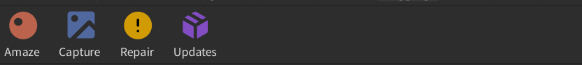

---

## The panel at a glance

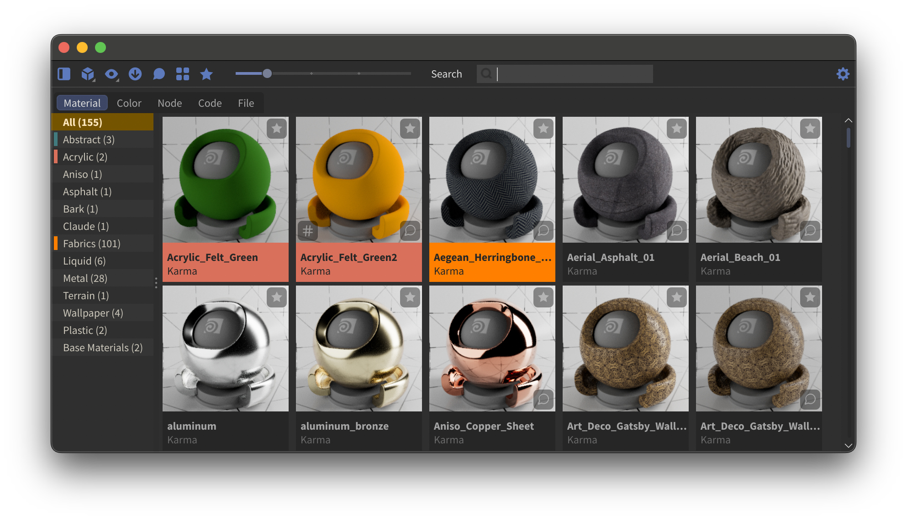

The **section tabs** run along the top: Material, Color, Node, Code,
File. Each section keeps its own category, view mode and scroll
position. Sections can be hidden in Preferences ▸ Show/Hide.

The **toolbar** runs along the top of the panel. Left to right:

| | | |
|:--:|---|---|
|  | **Show Categories** | Shows and hides the sidebar. |
|  | **Import/Generate** | Gallery Import (.gal), Package Import (.amazepkg), Generate Material. |
|  | **Filter** | Filters the grid. In Material, by renderer: All, Karma, Redshift, Octane. |
|  | **Online** | Switches to the online sources and back. |
|  | **Comments** | Opens the [Comments pane](#comments). |
|   | **Grid / List** | Two views of the same assets. |
|  | **Favorites** | Shows favorited assets only. |
| 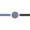 | **Size slider** | Thumbnail size, 16–200 px. Scales list rows too. |
|  | **Search** | Searches names and tags in the current section. A leading colon searches tags: `:metal` finds everything tagged metal. |
|  | **Capture** | Takes a preview of the open scene. File section only. |
|  | **Preferences** | Opens [Preferences](#preferences). |

**Import/Generate**	and **Filter** menu. 

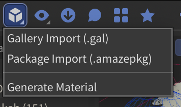
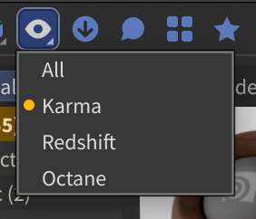

**Favorites** filters the grid down to what you have starred.

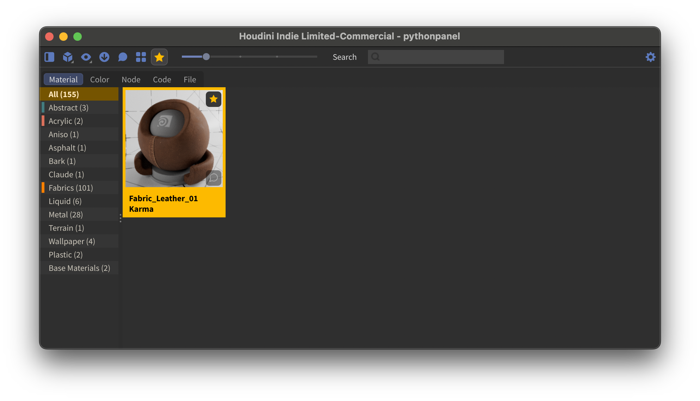

**List mode** shows the same assets as rows.

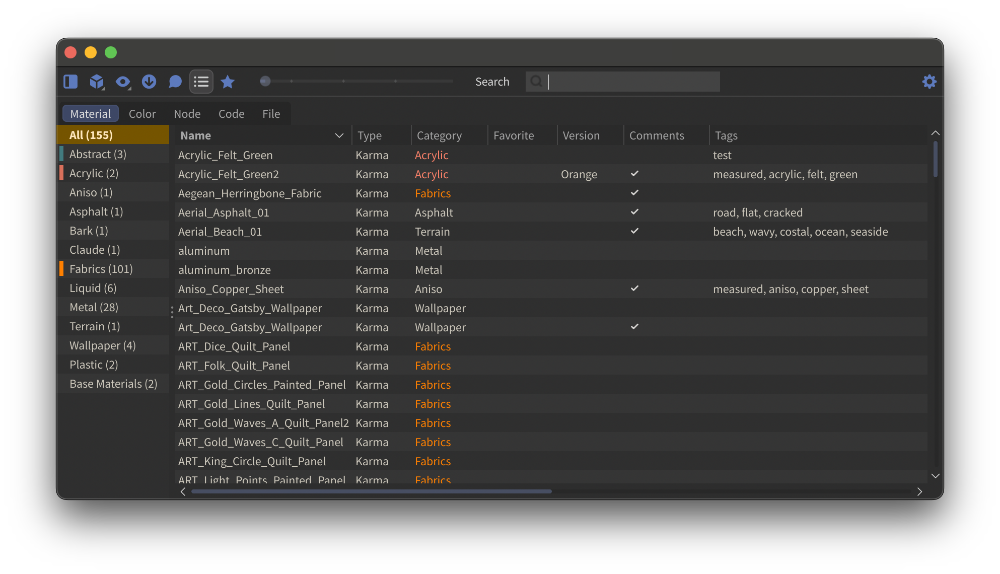

**Name** and **Type** are always there. **Category**, **Favorite**,
**Version**, **Open**, **Comments**, **Tags**, **License**, **Date** and
**ID** appear where the section has them. Favorite, Open and Comments
draw as ticks, and Category takes the [category colour](#category-colors).
Click a column heading to sort by it; drag the edge of a heading to set
its width.

The **sidebar** holds categories (Material, Node, Code), registered
folders (File) or palette groups (Color). Right-click to add, rename or
remove one, or to give a category a [colour](#category-colors). **Sort
by name** puts the categories in alphabetical order once, with All on
top; drag them where you like afterwards, and sort again whenever.
Per-category counts and hiding empty categories are in
Preferences ▸ Look.

The sidebar keeps the order you give it. Press and hold a row for about
half a second and it picks up — drag it where you want, let go to keep
the new order, or press Esc to put it back. **All** stays at the top,
and a new category appears at the bottom until you move it. This works
in every section, File's registered folders included. Category order
travels with the library; folder order stays with each machine.

Both side panes — the sidebar and the Comments pane — keep the width
you drag them to, across sessions. The grid takes up the slack.

A tile can carry up to four **badges**, one per corner, each a glyph on
a dark backdrop:

| | | |
|:--:|---|---|
|  | top-left | the scene you currently have open (File) |
|  | top-right | the favorite button — on every tile: dim when not a favorite, brighter under the cursor, amber when favorited. Click to toggle; with several tiles selected, clicking a selected tile's star toggles them all |
|  | lower-left | has more than one [version](#versions) — click it to browse them |
|  | lower-right | carries a [comment](#comments) — click it to open the Comments pane on that asset |

---

## Material

Houdini-native material networks with rendered shaderball thumbnails:
Redshift (classic and USD builders), Karma/MaterialX, Octane (classic
and Solaris).

### Saving

Right-click a material node in the network editor ▸ **Save to
Amaze**. Name it, give it a category and tags. Amaze builds a scene
around the node, renders a shaderball and files it away.

Saving a node Amaze recognises — from the ID stamp a previous save left
on it, or a unique name match — offers **Save Version / Save New /
Cancel**. Multi-selections always save as new.

> Thumbnails need `$OCIO` set, and Karma additionally needs an open
> Scene Viewer (it reads the display/view transform from one). Renders
> can be switched off entirely in Preferences ▸ Render.

### Versions

Saving over a material you already have creates a version.

Tiles with more than one version carry the

badge in their lower-left corner. Click it to open the versions
window, titled with the asset's name: pick a version to make it
active, or rename the selected one.

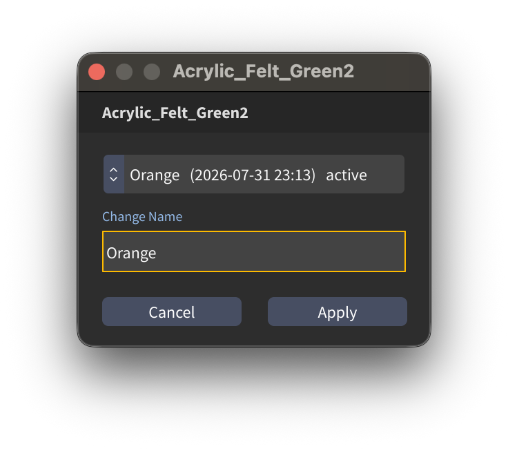

Turn the behaviour off in Preferences ▸ Library ▸ **Material
Versions**.

### Load Assets

- **Double-click** imports into the context you are working in.
- **Copy To ▸ /mat** and **Copy To ▸ /stage/materiallibrary** name the
  destination explicitly. The second lands inside a material library
  under `/stage`. A Redshift material saved in the classic Redshift
  container is rebuilt into the Solaris container on the way in; the
  saved material is not changed.
- **Drag it** — see [Drag and drop](#drag-and-drop).

### Organising

Right-click a tile: **Copy To**, **Convert to**, **Update Preview**,
**Customize**, **Favorite**, **Export Package** and **Delete**. Name, Category and Tags are edited in
[Customize](#tile-icons); Date, ID and License are columns in
[list mode](#the-panel-at-a-glance).

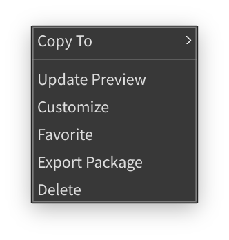
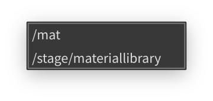

Assets can also be dragged onto a sidebar category to file them there.

### Convert to

Right-click a material ▸ **Convert to** ▸ **Karma** or **Redshift**.
The renderer the material already uses is greyed. The conversion
rebuilds the network for the other renderer as a new entry next to the
original, on the same texture files, and reports what it could not
translate. Shaders with no equivalent are named in the report.

---

## Online materials

The 
**Online** button in the toolbar switches to the online sources. Press
it again to return to your own library. The sources appear as a tab
strip where the section tabs were.

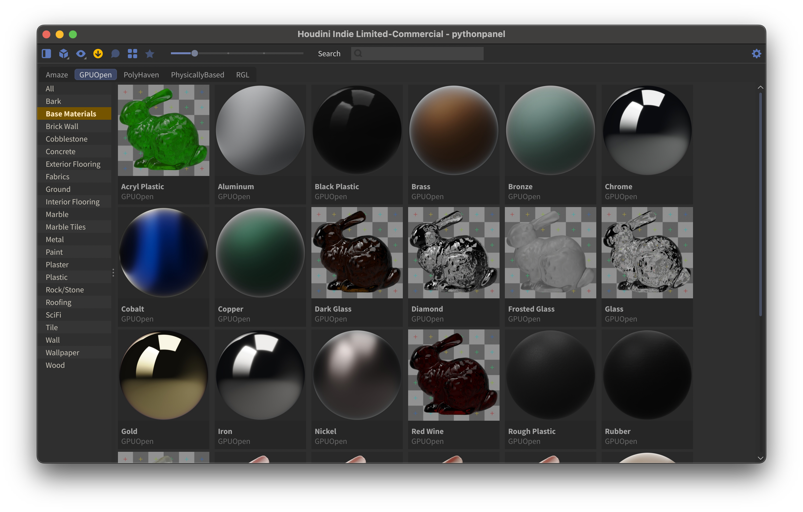

| Source | What it is | Licence |
|---|---|---|
| **PolyHaven** | Photoscanned PBR materials, with textures | CC0 |
| **GPUOpen** | AMD's MaterialX library, with textures | MIT Public Domain |
| **PhysicallyBased** | 86 measured reference values: real copper, real water, real skin. No textures | CC0 1.0 |
| **RGL (EPFL)** | 62 laboratory-measured materials from the Realistic Graphics Lab | CC0 1.0 |
| **Amaze** | The official [packages](#packages), ready to import or restore | per package |

Right-click a material, or a multi-selection:

- **Import to Materials ▸ Karma** or **▸ Redshift** downloads it,
  builds the material for that renderer and saves it into your library,
  with a thumbnail if renders are on. Redshift is greyed when the plugin
  is not loaded.
- **Import to Scene ▸ Karma** or **▸ Redshift** builds it into the
  material library you are working in, or `/mat`, and writes nothing to
  your library.
- **Restore** appears on Amaze packages and puts back the entries a
  package carries.
- **Refresh** re-reads the source now.

**Double-click imports to the scene**, as it does everywhere else.

Every import records its source, author, link and licence. None of
these sources requires attribution.

### Gallery Import (.gal)

**Import/Generate ▸ Gallery Import (.gal)** reads a Houdini gallery
file, the Material Palette's own included, and turns every material
preset in it into a library material. Thumbnails are not rendered
during a bulk import; select the new materials afterwards and use
**Update Preview**.

---

## Generate Material

For building test materials quickly.

**Import/Generate ▸ Generate Material** builds one material into the
material library you are working in.

Amaze ships 148 measured materials — 86 PhysicallyBased reference
constants and 62 RGL measurements. Generation starts from one of them
and stays inside its physical class:

- **Metals** keep their spectrum. A metal's colour is its reflectance,
  so copper stays copper: it drifts a few percent, or blends toward
  another measured metal the way an alloy sits between two elements,
  and takes its finish from a measured metal surface.
- **Glass and liquids** keep their measured IOR exactly.
- **Skin, marble and milk** keep their measured scattering distance.
- **Opaque dielectrics** take a free hue, with roughness from the
  measurement.

Clearcoat, sheen and emission are not in the measurements, so their
rates come from a corpus of 287 authored materials: about a third carry
a clearcoat, almost none emit.

Every generated material writes its lineage into the **node comment** —
which measurement it came from, and what was varied. Generated
materials are scene nodes. Keeping one means saving it with **Save to
Amaze**, like any material you built by hand.

---

## Color

Comes pre-filled with colour-theory palettes — Sanzo Wada's *A Dictionary of Color Combinations*, Paul Klee, Josef Albers, Johannes Itten. Delete any you do not want.

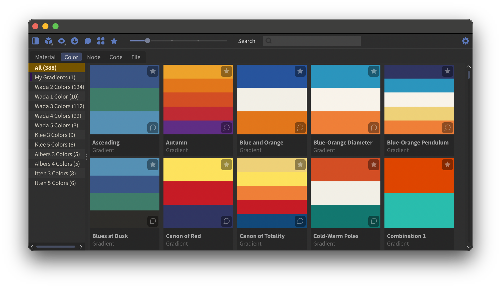

Right-click a tile:

- **Apply** pushes the palette onto a selected node's ramp parameter.
  Where the selected node has no ramp parameter, Amaze creates the ramp
  node instead, as double-clicking the tile does.
- **Apply as ▸** does the same and sets the ramp's interpolation:
  Constant, Linear, CatmullRom, MonotoneCubic, Bezier, BSpline or
  Hermite.
- **Copy Color ▸** lists the swatches by name and hex code, each with
  its colour. Picking one copies the hex to the clipboard.
- **Customize**, **Favorite**, **Export Package** and **Delete**.

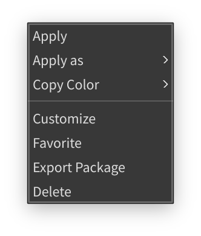
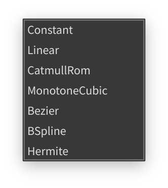
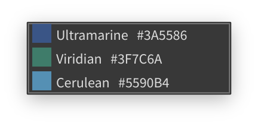

To save your own: right-click a node with a colour ramp ▸ **Save
Gradient to Amaze**.

---

## Node

Save node setups — a whole network, a selection, or a single node — and
load them back. Works in any context Amaze supports: SOP, Copernicus,
LOP, DOP, TOP, CHOP and object level. Each asset records which context
it came from, shown on its tile.

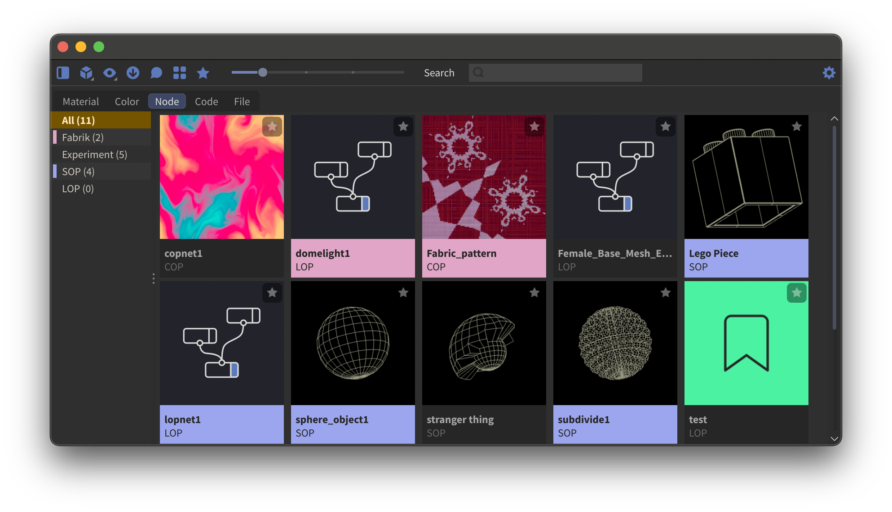

Right-click a network container — a `geo`, a `copnet`, a `lopnet`, a
subnet — ▸ **Save Network to Amaze** to keep its whole interior, or
right-click the nodes themselves ▸ **Save Selection to Amaze**. With
several nodes selected the selection wins, and the label names which
one you are about to get.

Double-click, drag a tile, or right-click ▸ **Load** to bring the nodes
back. They land in the network you release over, or in a fresh
container of the right type.

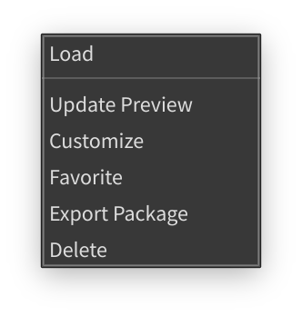

**Assets load only into a matching context.** A SOP asset dropped on a Copernicus
network is refused with a message, and nothing is created.

Thumbnails follow the context: a Copernicus asset shows its own output
image, a SOP asset shows its geometry, and everything else shows the
node icon.

---

## Code

A snippet library for VEX, OpenCL and Python, with syntax-highlighted
previews on the tiles. A set of **examples** is seeded into a new
library to start from; deleting one does not bring it back.

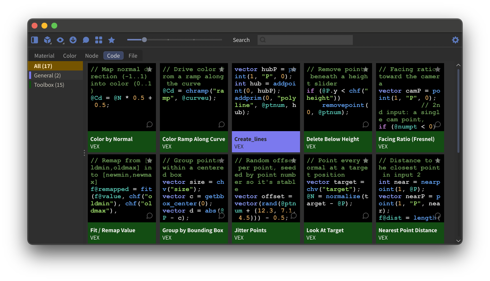

Right-click a tile:

- **New File** opens the editor on a blank snippet.
- **Apply** pushes the snippet into the selected node's code parameter.
- **Edit** opens it in the editor, with Name, Language, Category and
  Tags above the code.
- **Customize**, **Favorite**, **Export Package** and **Delete**.

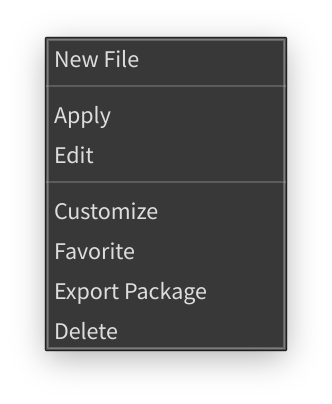
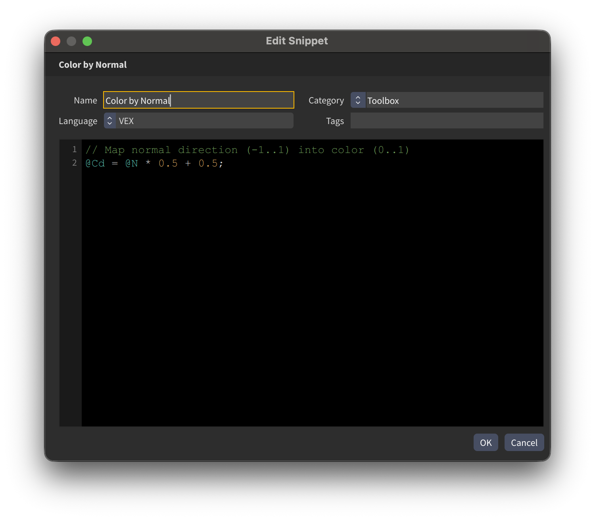

Double-click or drag a snippet onto a node to apply it. To save one:
right-click any node with a code parameter ▸ **Save to Amaze**.

---

## File

Browse folders on disk.

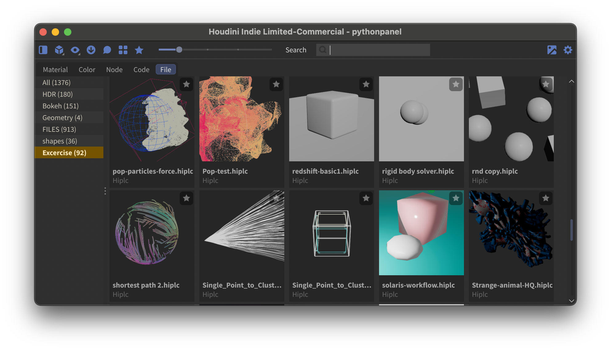

- **Images** (PNG, JPG, EXR, HDR, TGA, RAT, …) get cached thumbnails.
  **Double-click** or **Load to Node** pushes the file onto a selected
  node's image parameter; drag one onto any parameter field like a
  file from Finder or Explorer. Formats Qt cannot read are converted in
  the background — the number of parallel conversions is in
  Preferences ▸ Render. While the conversion bar is showing, a
  **Cancel** button sits at the right end of the tab row and stops the
  batch; thumbnails already made are kept, and revisiting the folder
  simply picks up where it left off.
- **Geometry** (`.bgeo`, `.obj`, `.fbx`, `.abc`, `.usd`, …) gets
  viewport-rendered thumbnails, wire over shaded. **Double-click** or
  drag into a network to import in context; the import puts your
  current node and display flag back where they were. A recursive scan
  of a big library can queue many first-time renders — the pass is
  interruptible with Esc and resumes later.
- **Scenes** (`.hip`, `.hiplc`, `.hipnc`) **open on double-click**,
  with Houdini's own save prompt in charge of unsaved changes. Drag one
  out of the panel and release anywhere outside it to open it the same
  way. The scene currently open carries a tick on its tile. Scene
  thumbnails are **captures**: open the scene from Amaze, frame the
  viewport, then right-click ▸ **Capture Preview**, or press the
  
  button in the toolbar.
- **Everything else** shows its system icon and has one action,
  **Copy Path**, which puts the path on the clipboard the way Houdini
  writes paths — see **Write Paths As** below. Hide these rows with
  Preferences ▸ Look ▸ **All show unknown files** off.

Right-click a row for **Load**, **Copy Path**, **Show Location**,
**Capture Preview**, **Customize**, **Favorite** and **Export
Package**. There is no **Delete**: these are your files on disk.

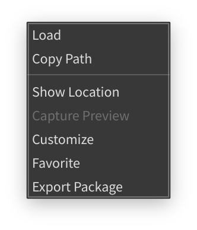

### Locations

Right-click the sidebar:

- **Add Location** registers a folder. Nothing is scanned or copied
  until you open it.
- **Remove** unregisters it and forgets its label, colour, Show
  Subfolders and Show All Files settings, its favorites, comments and
  tile icons, and its cached thumbnails. Re-adding the folder starts
  from scratch. Captures are kept, since nothing can render them again.

  Removing a folder removes it for everyone who uses the library, so it
  does not come back from the other computer. Where Amaze was open
  there at the time, close and reopen it to see the removal.
- **Locate** re-points a folder that moved on disk. Favorites, its name
  and its settings follow.
- **Label ▸** gives it your own name. The default is the path itself.
- **Show Subfolders** is per location, so a deep asset tree can recurse
  while a flat downloads folder stays shallow. Off by default.
- **Show All Files** carries the Look tab's setting for unknown files.
- **Set Color** and **Clear Color** work as they do on a
  [category](#category-colors).

### Write Paths As

Preferences ▸ Look ▸ **Write Paths As** controls how Amaze writes
paths — Copy Path and the location labels: **$HOME** (the default),
**$JOB**, **$HIP**, or **Absolute**. A variable applies when the
path lives under it; otherwise the path stays absolute.

---

## Packages

A **package** is a single `.amazepkg` file carrying assets out of your
library: their files, thumbnails, categories, tags and comments. It is
how a set of assets moves to another machine, another library, or
another person.

**Making one.** Select any number of tiles, right-click ▸ **Export
Package**, and choose where to write it. This is on every section's
tile menu. To take a whole category at once, right-click it in the
sidebar ▸ **Export Category**.

**Bringing one in.** **Import/Generate ▸ Package Import (.amazepkg)**
reads a package into your library. Every asset arrives with a new
identity and is filed under a category called **Import**, so importing
the same package twice gives you two copies rather than overwriting
what you have.

**Restoring instead.** The **Amaze** source in the
[online browser](#online-materials) carries the official packages.
Right-click one ▸ **Restore** and its entries go back under their
original identities, matching what is already there rather than adding
beside it. This is the way to restore a default palette or
material you deleted.

---

## Tile icons

A LOP setup, a DOP network and a snippet have nothing to render, so
they fall back to the node icon. A tile icon replaces that with a
symbol and a colour of your choosing.

Right-click any tile ▸ **Customize**.

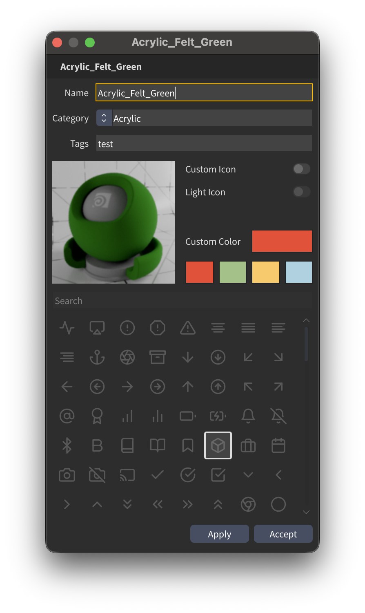

The **Custom Icon** switch is the door: off, the tile keeps its own
thumbnail; on, pick one of 287 Feather icons on a background colour —
four presets, or the colour chip beside **Custom Color** for any other.
The preview shows the finished tile. **Light Icon** switches the symbol
between dark and light.

The dialog also carries the asset's **Name**, **Category** and
**Tags**. On a multi-selection, Category moves every selected tile and
Tags adds to what each tile already has. **Apply** commits and stays
open; **Accept** commits and closes. Closing the window any other way
changes nothing.

- Works on every section that has tiles — Material, Node, Code and
  File, scenes included. Color keeps its own swatches.
- Applies to the whole selection, so twelve LOP setups take one icon in
  one go.
- A tile with a rendered thumbnail keeps it. The icon sits beside it,
  and switching **Custom Icon** off brings the render back.
- Your choice is stored with the library and travels with it.

The line weight is in Preferences ▸ Look ▸ **Tile Icon Line**.

---

## Category colors

Right-click a category in the sidebar ▸ **Set Color…**. Every tile in
that category paints the strip under its thumbnail — the one carrying
the name and type — in that colour, and the category's own sidebar row
gets a matching bar down its left edge.

In [list mode](#the-panel-at-a-glance) the Category column takes the
same colour. **Clear Color** puts the normal dark strip back.

The name and type text flips between dark and light automatically, so
any colour stays readable. Renaming a category carries its colour
across; deleting one takes the colour with it.

Categories are one per asset. Use tags where something belongs in
several places at once.

**Export Category** on the same menu writes the whole category out as a
[package](#packages).

---

## Comments

The 
**Comments** button in the toolbar, between Online and Grid/List, opens
the **Comments pane**: a page docked beside the grid, one page per
asset. Its background shows whether the pane is open.

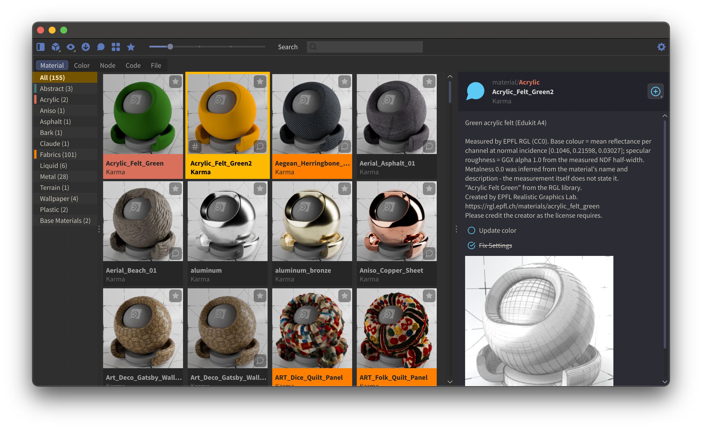

The page is one flowing document. Select a tile and write. Click **+**
for what you can add at your cursor:

- **Bullet point** — a framed line you type into, and keep writing
  above or below it.
- **Image** — pick a picture and it is copied into your library, so it
  travels with the library rather than pointing at wherever you found
  it. It is scaled to the width of the pane, and typing continues on
  the line below.

Enter inside a to-do adds another; Enter on an empty one returns to
plain text; clicking a to-do's marker checks it off and strikes it
through. Emptying a to-do's text removes it. Everything saves as you
type.

To take a to-do apart, backspace at the start of its line: the frame
becomes ordinary text and the next backspace eats the words. Deleting
across the line above or below a to-do simply joins the lines — the
frame keeps its marker.

Comments are stored **in the library**, so they travel across machines
and survive a folder being removed and re-added. A tile that carries a
comment shows the
 badge in
its lower-right corner; click it to open this pane on that asset.

Every section takes comments — materials, palettes, nodes, snippets and
File rows alike.

---

## Drag and drop

Amaze manages the whole drag gesture itself, so a drag behaves the same
in every section and every destination.

**Materials**

- Onto an **OBJ viewport** object — assigns the material to it.
- Onto a **Solaris (LOP) viewport** object — a menu appears:
  - **Swap ‹material›** — replaces a material already bound to that
    prim. The old one is removed from the library node if nothing else
    references it.
  - **Set as Material on ‹prim›** — one entry per ancestor prim, so you
    can bind to the mesh or to the whole geo.
- Onto a **`materiallibrary` LOP** in the network editor — imports into
  it, wired and registered.
- Onto the **network editor** — imports the material there.

While you drag over a viewport, the prim under the cursor highlights
using Houdini's own scene-graph highlight. A drop that lands nowhere
useful shows a miss indicator
.

**Everything else**

- **Images and unknown files** onto a parameter field — like a file
  from the OS file browser.
- **Geometry** into a network or viewport — imports in context at the
  release point.
- **Scenes** released anywhere outside the panel — opens the scene,
  same as double-click.
- **Code** onto a node — fills its snippet parameter.
- **Any asset** onto a sidebar category — files it there.

---

## Preferences

The 
gear button opens it. It is a floating window, not a modal, so it can
stay open while you work. Five tabs.

### Library

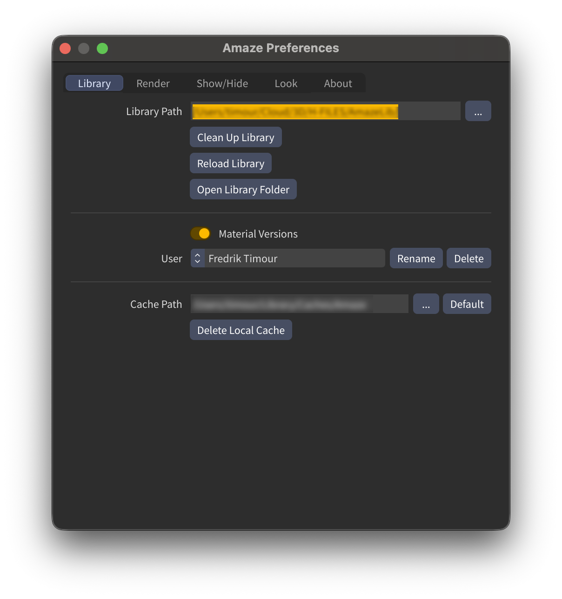

**Library Path** and the `...` button beside it choose the library.
**Clean Up Library**, **Reload Library** and **Open Library Folder**
act on it. **Material Versions** turns
[versions](#versions) on and off.

**User** is who you are in this library. Favorites, File folders and
the versions you save are kept per user, so picking yourself on another
computer gives you the same things back. The dropdown switches users,
**Rename** changes the name, **Create a new user...** adds one and
switches to them, and **Delete** removes a user with their favorites
and registered folders everywhere the library syncs. It asks first, and
a machine still signed in as that user is asked who they are next time
it opens.

**Cache Path** and **Delete Local Cache** govern the thumbnail cache on
this machine.

### Render

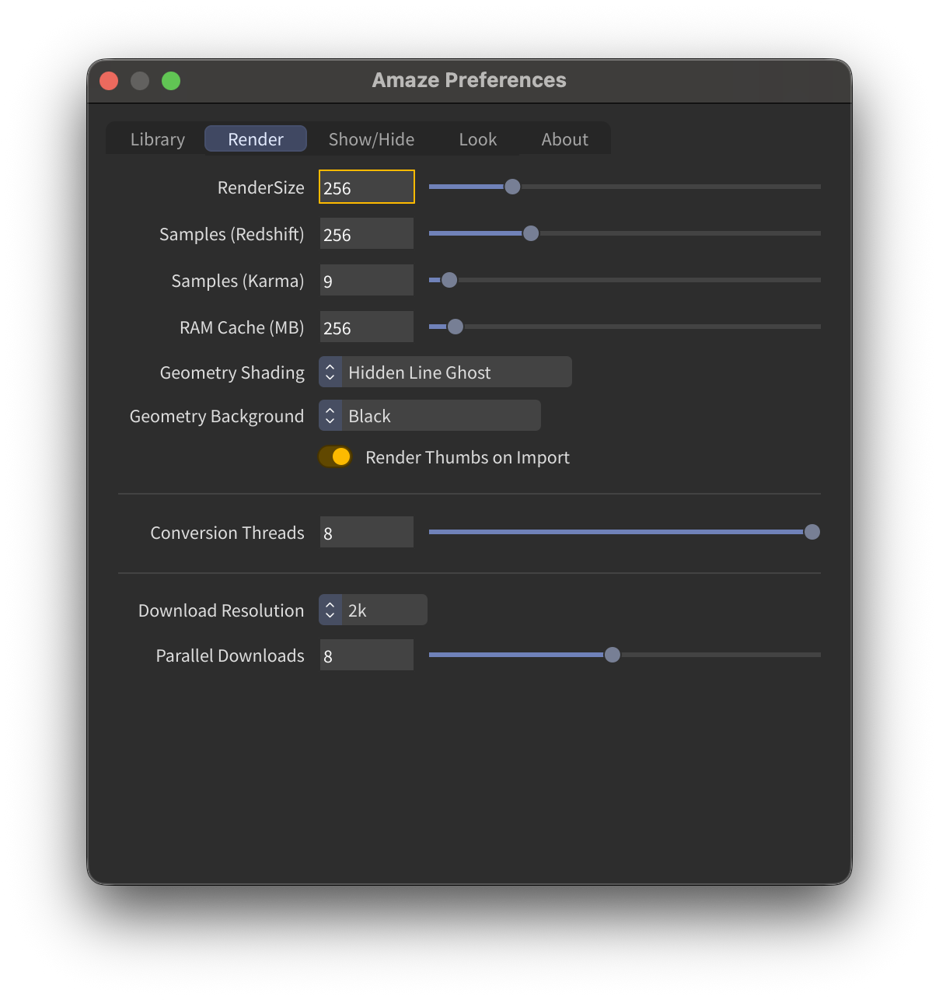

**RenderSize**, **Samples (Redshift)** and **Samples (Karma)**,
**RAM Cache (MB)**, **Geometry Shading**, **Geometry Background** and
**Render Thumbs on Import**. Below the divider, **Conversion Threads**
for texture conversion, then **Download Resolution** and **Parallel
Downloads** for the online sources.

### Show/Hide

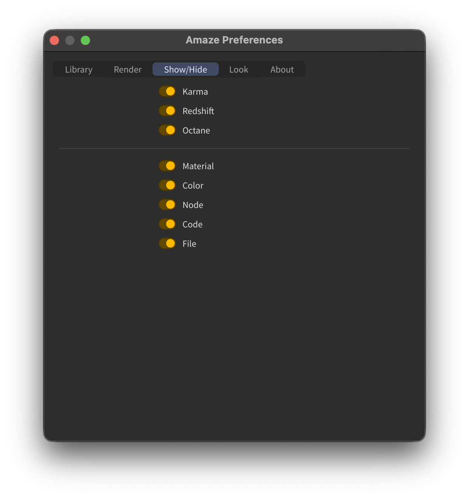

Which renderers appear in the [Filter](#the-panel-at-a-glance) menu,
and which sections appear at all.

### Look

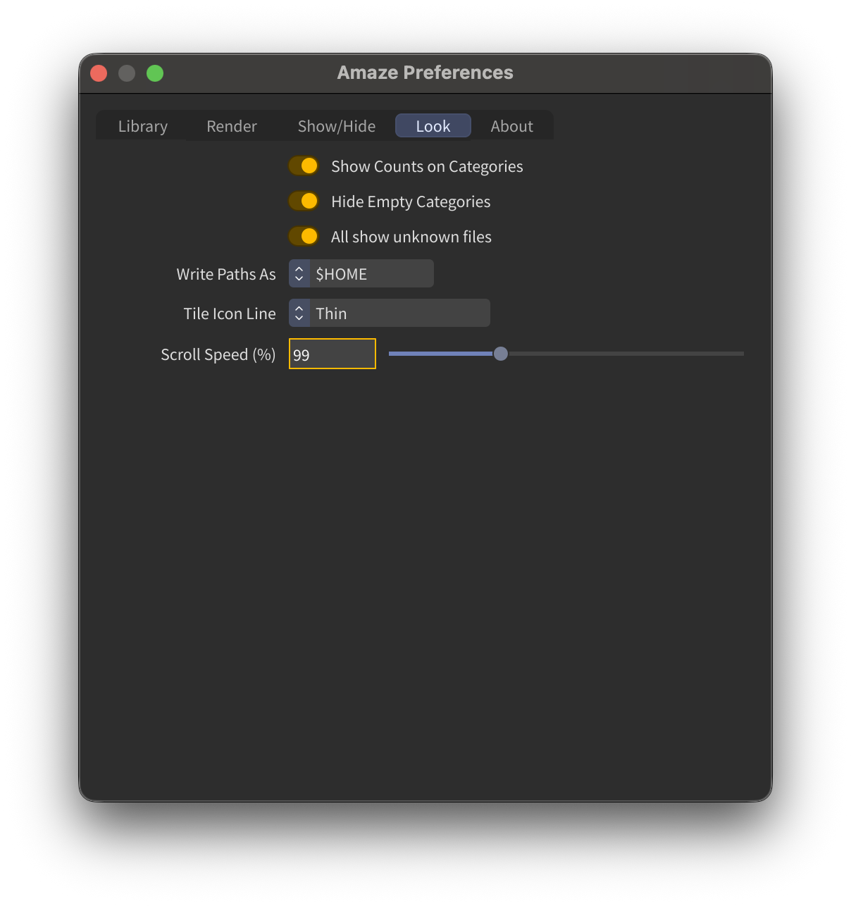

**Show Counts on Categories**, **Hide Empty Categories**, **All show
unknown files** (the File section's system-icon rows), **Write Paths
As**, **Tile Icon Line** (Thin, or Feather's own Regular) and **Scroll
Speed (%)**.

### About

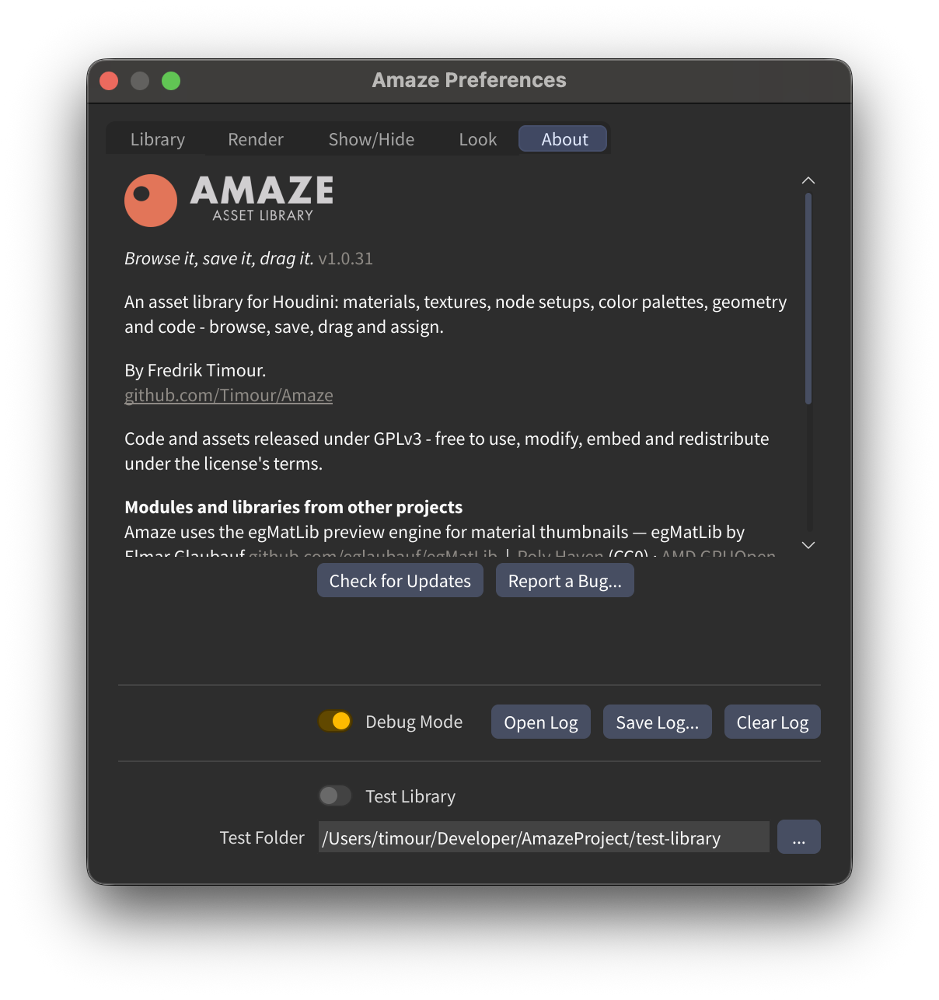

Credits and licences. The version line above the buttons says what you
are running and carries every update answer. **Check for Updates** asks
the release page whether a newer Amaze exists; where there is one, the
same button becomes **Install Update** and puts it in place. **Report a Bug...** opens the Amaze bug
page in your browser with your Amaze, Houdini and OS versions already
filled in; nothing is sent until you press Submit there.

Then the debug controls — **Debug Mode**, **Open Log**, **Save Log...**
and **Clear Log** — and **Test Library**, which points Amaze at a
throwaway library in the folder named below it. Your real Library Path,
Cache Path and registered folders come back when you switch it off.

> **Where settings are kept.** The render settings and renderer
> choices, conversion and download throughput, and how paths are
> written are stored **with the library** and shared by everyone who
> opens it: change the thumbnail samples on one computer and the other
> answers the same. What is yours on this machine — view mode, icon
> sizes, panel widths, which tabs show — is stored where the OS keeps
> preferences (`~/Library/Preferences/Amaze` on macOS,
> `%APPDATA%\Amaze` on Windows, `$XDG_CONFIG_HOME/Amaze` on Linux),
> which updates and reinstalls leave alone. Where the library is
> unreachable, Amaze works on the last values it saw.

---

## Housekeeping and troubleshooting

**Clean Up Library** (Preferences ▸ Library) scans the library in one
pass: entries whose files are missing, uncategorized assets to rescue,
category names to normalise, registered folders that no longer exist,
favorites pointing at missing files. It reports in one summary and
renders nothing.

An entry whose files are missing is reported and kept — a file mid-sync
looks the same as a file that is gone, and deleting the entry would
take its tags, comments and favourites with it. Remove it yourself with
**Delete** once you know. Files that no list claims move into Amaze's
holding folder on this computer, outside your library, are named in the
summary, and stay there for 30 days. Folders on a drive that is not
mounted are left alone.

**Repair** is the shelf tool to reach for when Clean Up Library
refuses, or when the panel will not open. It reads your library, says
what is wrong, and offers two remedies: rebuilding the list from the
recovery copy stored beside each asset, or putting back one of the
snapshots. Its strongest action is moving files into a dated folder
inside your library.

It lives on the shelf rather than in the panel because a running panel
writes the list as you work, and would overwrite a repair made from
inside it seconds later. From the shelf, nothing holds your library.

Every write snapshots the list first — rolling backups plus a first-run
copy — and a concurrent write from a second Houdini session is merged.

**Overwrite can be switched off for a whole library**, in Preferences ▸
Library. Unlike the rest of Preferences this setting travels with the
library, so two computers pointed at one library agree about it. With
it off, saving over an existing material is refused and the Save dialog
stops offering Overwrite.

That covers the **list** of your assets. An asset's own files are a
separate matter: choosing **Overwrite** when you save over an existing
material replaces them, and the last save wins.

**When something looks wrong**, turn on **Debug Mode** (Preferences ▸
About) and reproduce it. The log records what the app did, and
**Save Log...** writes a copy to attach to a bug report.

**A material renders black.** Usually a texture that failed to
download, or a material library node whose material list no longer
covers the material. The log names both cases.

**Changed a Python file.** Houdini caches modules per session, so quit
and relaunch. Reopening the panel loads the cached modules.

---

## Credits and licence

Amaze uses code from [egMatLib](https://github.com/eglaubauf/egMatLib)  for its preview engine for material thumbnails. Thank you.

Colour palette sources: Sanzo Wada (public domain, via dblodorn/sanzo-wada), Paul Klee, Josef Albers, Johannes Itten (interpretive palettes from public-domain works).

Tile icons are [Feather](https://feathericons.com) by Cole Bemis (MIT).

Online material sources: [Poly Haven](https://polyhaven.com/) (CC0),
[AMD GPUOpen](https://matlib.gpuopen.com/) (MIT Public Domain),
[Physically Based](https://physicallybased.info/) by Anton Palmqvist
(CC0 1.0), and [EPFL RGL](https://rgl.epfl.ch/materials) measured
materials (CC0 1.0). Colour palettes come from public-domain works.

Amaze is **GPLv3** — see [LICENSE](LICENSE).
