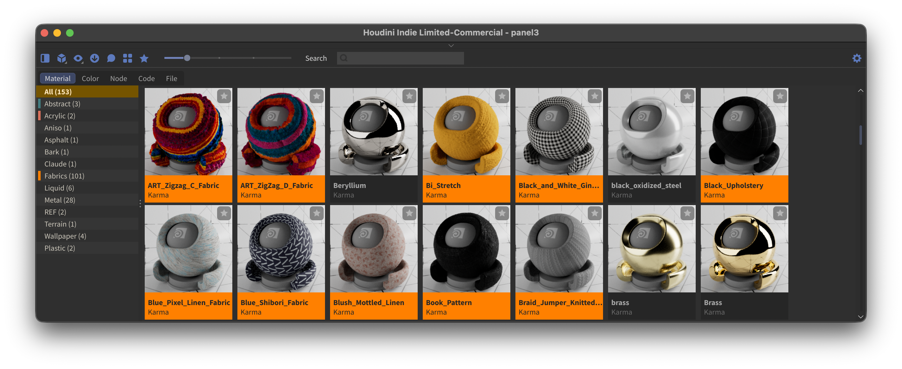

<picture>
  <source media="(prefers-color-scheme: dark)" srcset="docs/LightLogo.svg">
  
</picture>

### An assets manager for Houdini

Amaze is an assets manager for SideFX Houdini. You save materials, colour palettes, groups of nodes and code snippets into it, point it at your folders on disk, and pull it all back into your scene when you need it.

Drag a material onto an object in the viewport to assign it. Save a group of nodes from any network — SOP, Copernicus, LOP and more — and import it back into a matching one. Drop code snippets into wrangles, apply palettes onto ramp and colour parameters, and drag files from your registered folders onto file parameters. Free online material libraries — PolyHaven, AMD GPUOpen and more — are built in.


[](docs/images/interface.png)

**→ [Read the manual](MANUAL.md)** — every function, section by section.

## Sections

Everything you save shows up as a tile in the grid — a picture and a name — sorted into sections, one tab per kind.

- **Material** — save the materials you build and bring them back into any scene: drag one onto an object in the viewport to assign it, or import into `/mat` or a LOP material library. Redshift (classic + USD builders), Karma/MaterialX, Octane (classic + Solaris builders). Filter by category, tag, favourite or renderer.
- **Color** — save gradients and palettes, and apply them straight onto parameters: stepped or linear ramps onto ramp parameters, single swatches onto colour parameters. Ships with palettes inspired by the colour theories of Sanzo Wada, Paul Klee, Josef Albers and Johannes Itten.
- **Node** — save a group of nodes from any context (SOP, Copernicus, LOP, DOP, TOP, CHOP, object level) — a whole network, a selection, or one node — and import it back into a matching context.
- **Code** — keep the VEX, OpenCL and Python snippets you reach for: double-click to apply to the selected node, or drop one into the network.
- **File** — register folders on disk and use their contents from the panel: drag images onto file parameters, import geometry in context, open scenes with a double-click.
- **Comments** — write text, add images and to-dos to any asset.
- **Category colors** — colour-code your library: give a category a colour and every tile in it carries that colour.

## Highlights

- **Online material libraries, built in** — browse free CC0/MIT materials from PolyHaven, AMD GPUOpen, PhysicallyBased and EPFL RGL, plus Amaze's own packages, behind the toolbar's Online button. Import into your library, or straight into the scene.
- **Drag and drop everywhere** — drop a material onto an object in the viewport: in OBJ it's assigned, in Solaris you pick the prim and it imports into that stage's `materiallibrary`. Drag a tile onto a sidebar category to refile it, and files onto parameter fields.
- **Versions** — re-saving a node that matches a library entry offers Save Version / Save New; old states stay as versions.
- **Redshift → Karma converter** — best-effort translation into Karma Material Builders, with a report of everything it couldn't translate.
- **Updates from Preferences** — checks the GitHub release feed, verifies the download, and backs up the install it replaces.
- **Fast** — thumbnails load in the background and cache to disk.
- **Storage you can trust** — assets live on disk as plain Houdini node archives and a JSON index; they load with vanilla Houdini even without Amaze.

## Compatibility

Houdini 21.0 or newer — developed and tested on 21.0 and 22.0, macOS (Apple Silicon). Linux and Windows should work but see less testing.

## Installation

1. Copy (or clone) this repo to a folder of your choice, e.g. `/path/to/Amaze`.
2. Copy the `Amaze.json` template from the repo root into `$HOUDINI_USER_PREF_DIR/packages/` and point `AMAZE` at the folder from step 1:

```json
{
    "env": [
        { "AMAZE": "/path/to/Amaze" }
    ],
    "path": [ "$AMAZE" ]
}
```

3. Launch Houdini and add an **Amaze** pane tab.
4. Open Preferences (the gear) and pick a library folder — that's where your saved assets live. Keep it outside the plugin folder.

Preferences are stored per user, outside this repo — updating with `git pull` never touches them.

## Status

Actively developed. Found a bug? Update to the latest release first, then [open an issue](https://github.com/Timour/Amaze/issues).

## Acknowledgements

- **[Elmar Glaubauf](https://github.com/eglaubauf)** — Amaze uses the [egMatLib](https://github.com/eglaubauf/egMatLib) preview engine for material thumbnails. Thank you.
- Color palette sources: Sanzo Wada (public domain, via [dblodorn/sanzo-wada](https://github.com/dblodorn/sanzo-wada)), Paul Klee, Josef Albers, Johannes Itten (interpretive palettes from public-domain works).

## License

**GPLv3**, same as upstream — see [LICENSE](LICENSE). Free to use, modify, embed and redistribute under the license's terms.
