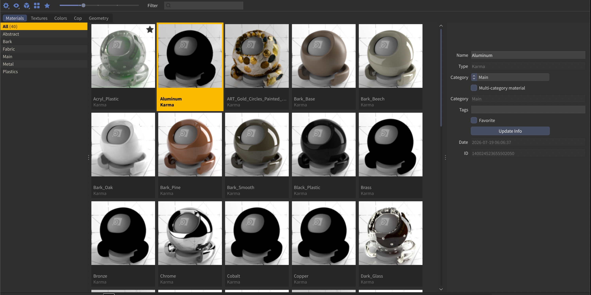

### Turn on, Drag in, Drag out


> **⚠️ Work in progress.** Amaze is under active, rapid development and `main` is a moving target. The app reports a version (`branding.APP_VERSION`, shown in Preferences ▸ About and in the debug log's session header), but releases are not tagged — assume the tip. It runs in daily production use by its author, but if you found this repo in the wild, expect rough edges.

Materials, colour palettes, node setups, code, and the files on your disk — images, geometry, scenes, all of it — the things you dig through folders and old scenes to find, gathered into one place and always a click away. Browse it, save to it, drag it straight into your scene.

Save a material and get a real rendered thumbnail back. Drop a texture onto a parameter like it came from Finder. Pull a free material from PolyHaven without ever leaving Houdini. Lift a colour straight out of a Josef Albers study or a Sanzo Wada plate. Keep the wrangle you keep rewriting. Assign a shader by dragging it onto the object in your viewport — done.


[](scripts/python/amaze/res/img/assetlib_ui.png)

**→ [Read the manual](MANUAL.md)** — every function, section by section.

## Sections

- **Material** — a curated library of Houdini-native material networks with rendered shaderball thumbnails. Redshift (classic + USD builders), Karma/MaterialX, Octane (classic + Solaris builders), Mantra. Categories, tags, favorites, renderer filter, search.
- **Color** — curated color-theory palettes (Sanzo Wada's *A Dictionary of Color Combinations*, Paul Klee, Josef Albers, Johannes Itten) plus your own saved gradients. Apply as stepped or linear ramps, or pick single swatches for color parameters.
- **Node** — save node setups from any context (SOP, Copernicus, LOP, DOP, TOP, CHOP, object level): a whole network, a selection, or one node. Copernicus assets use their own output image as the thumbnail, SOP assets their geometry, the rest the node icon. An asset is only ever imported back into a matching context.
- **Code** — a reusable snippet library for VEX / OpenCL / Python, with a syntax-highlighted preview on each tile and a curated "Starter Toolbox" to get going. Double-click or drag onto a node to apply.
- **File** — register any folders on disk and browse everything in them. Images (PNG/JPG/EXR/HDR/RAT/...) get cached thumbnails and load onto file parameters; geometry (`.bgeo`, `.obj`, `.fbx`, `.abc`, `.usd`, ...) gets viewport-rendered thumbnails and imports in context; Houdini scenes open on double-click and carry viewport-captured thumbnails; everything else shows its system icon and copies its path — written as `$HOME`/`$JOB`/`$HIP` paths, your choice. Per-folder subfolder scanning, renameable locations, favorites.
- **Notes** — a page of text and to-dos per asset, docked beside the grid and stored with the library; tiles that carry a note show a small marker.
- **Tile icons** — any tile with nothing to render can carry a Feather icon on a colour of your choice, picked per asset and stored with the library.
- **Category colors** — give a category a colour and every tile in it shows that colour under its thumbnail, so structure is visible at a glance.

## Highlights

- **Online material libraries, built in** — browse thousands of free CC0/MIT materials from **PolyHaven**, **AMD GPUOpen**, **PhysicallyBased** and **EPFL RGL** right in the panel (View ▸ Import Materials). Import into your library, or straight into the scene when you just want the material in front of you. Every import keeps a credit + license note for its creators.
- **Generate Material** — builds a material from 148 real *measured* materials shipped with the plugin (PhysicallyBased reference constants + RGL laboratory measurements), generated in its own physical class: metals keep their spectrum, glass keeps its measured IOR, skin keeps its scattering distance. Each one records in its node comment which measurement it came from.
- **Drag and drop everywhere** — drag a material onto an object in the OBJ viewport to assign it, onto a Solaris viewport object to trigger Houdini's native material assigner, onto a `materiallibrary` LOP to import into it. Drag any asset onto a sidebar **category** to file it there (the category glows as you hover). Drag files onto parameter fields like files from Finder; drag a scene out of the panel to open it.
- **Standard file-save semantics** — re-saving a node that matches an existing library entry offers Save Version / Save New, and keeps the old state as a version.
- **Redshift → Karma converter (test)** — best-effort translation of Redshift materials into proper Karma Material Builders, with an honest report of everything it couldn't translate.
- **Houdini 22 theme aware** — the panel derives its palette from your Houdini theme (base/accent/highlight) automatically.
- **Fast** — background thumbnail loading, disk caches for image/geometry thumbnails, tuned to stay light with 500+ asset libraries.
- **Recoverable storage** — assets are Houdini-native node archives (`.mat` + `.interface` + JSON index). If the plugin dies, your assets are still loadable with vanilla Houdini.

## Requirements

- Houdini **21.0+** (developed and tested on 21.0 and 22.0, macOS/Apple Silicon; theme-following requires 22)
- Renderers: **Redshift** and **Karma/MaterialX** are the primary targets; **Octane** supported; Mantra works but sees less testing
- `$OCIO` must be set for material saves (thumbnail rendering)
- Python 3, unrestricted Houdini licensing (Commercial/Indie)
- Linux/Windows: nothing intentionally platform-specific beyond the texture-thumbnail fast path (which falls back automatically), but untested

## Installation

1. Copy (or clone) this repo to a folder of your choice, e.g. `/path/to/Amaze`.
2. Create a package file in a folder Houdini scans — a template ships at the repo root (`Amaze.json`); point `AMAZE` at the folder from step 1. Per version: `$HOUDINI_USER_PREF_DIR/packages/Amaze.json`. Or once for every installed version: the shared packages folder next to your Houdini installs (on macOS `/Applications/Houdini/sidefx_packages/Amaze.json`).

```json
{
    "env": [
        { "AMAZE": "/path/to/Amaze" }
    ],
    "path": [ "$AMAZE" ]
}
```

(Older installs that define `ASSETLIB` instead keep working — the plugin
accepts either name.)

3. Launch Houdini and add an **Amaze** pane tab (New Pane Tab Type → Misc → Amaze). Your preferences are stored in the OS preferences folder (`~/Library/Preferences/Amaze`, `%APPDATA%\Amaze`, `$XDG_CONFIG_HOME/Amaze`), never inside this repo — so updating with `git pull` can never clobber them.
4. First launch asks you to pick a library folder — that's where your saved assets live (keep it outside the plugin folder; changeable later in Preferences).

## Status

Actively developed (AI-assisted). Found a bug? Open an issue — but check the WIP banner above first: `main` moves fast.

## Acknowledgements

- **[Elmar Glaubauf](https://github.com/eglaubauf)** — Amaze uses the [egMatLib](https://github.com/eglaubauf/egMatLib) preview engine for material thumbnails, and grew from egMatLib as a whole. Thank you.
- Color palette sources: Sanzo Wada (public domain, via [dblodorn/sanzo-wada](https://github.com/dblodorn/sanzo-wada)), Paul Klee, Josef Albers, Johannes Itten (interpretive palettes from public-domain works).

## License

**GPLv3**, same as upstream — see [LICENSE](LICENSE). Free to use, modify, embed and redistribute under the license's terms.
